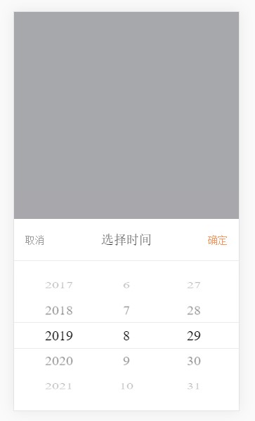

#### IOS风格日期选择器 (PC请切换到移动端模式打开)

>[http://codepen.io/jawil/full/WRBxya/](http://codepen.io/jawil/full/WRBxya/)

 ```
  * [datePicker plugin]
  * IOS风格日期选择器,仿滴滴打车预约用车时间选择器
  * @Author  jawil
  * @date    2017-02-17
  * @param   {[object]}   options [配置参数]
 ```

#### 运行预览

1. cd datePicker
2. npm install
3. npm run dev(浏览器预览)
4. npm run build(生成dist目录)


#### 示例：

```JavaScript
// UMD兼容规范，支持浏览器直接引入，require，define等多种JS模块化引入
<link rel="stylesheet" href="dist/datePicker.css">
<script src="dist/date-picker.min.js"></script>
 
datePicker({
    prev_years: 100, // 前置年数
    next_years: 5, // 后置年数
    callBack: function(timeStr, timeStamp) { // 点击确认获取到的时间戳和时间字符串
        console.log(timeStr, timeStamp)
    }
})
 ```
点击确认之后，回到函数callback可以拿到选择的时间字符串和时间戳。


#### 效果图




**有问题可以邮件联系我，欢迎提Issue和Pre**
